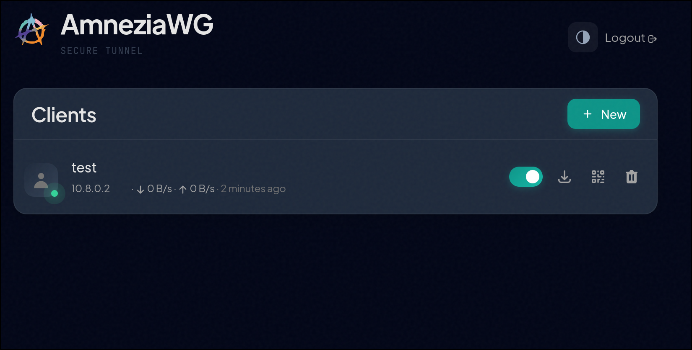

# AmneziaWG Easy

Fork of the archived [amnezia-wg-easy](https://github.com/spcfox/amnezia-wg-easy) with **AmneziaWG 2.0** support: S1-S4 padding, H1-H4 header ranges, and I1-I5 CPS (Custom Protocol Signature) packets for DPI evasion. Runs a native AmneziaWG datapath built from source — `amneziawg-go-proxy` (userspace fallback) and `amneziawg-tools-proxy` (awg/awg-quick) forks on an `alpine:3.20` runtime, using the host kernel module (DKMS) when present.

> **Note:** Most of the AWG 2.0 upgrade code in this fork was written by [Claude Code](https://claude.ai/code) (Anthropic's AI coding agent). Human-reviewed and tested.

<p align="center">
  
</p>

## Features

* All-in-one: AmneziaWG + Web UI.
* Easy installation, simple to use.
* List, create, edit, delete, enable & disable clients.
* Download a client's configuration file.
* Statistics for which clients are connected.
* Tx/Rx charts for each connected client.
* Gravatar support.
* Automatic Light / Dark Mode
* Multilanguage Support
* UI_TRAFFIC_STATS (default off)
* **AmneziaWG 2.0**: S3/S4 padding, H1-H4 ranges, I1-I5 CPS signatures
* **Site peers / custom AllowedIPs**: clients can be assigned custom AllowedIPs (comma-separated CIDRs) and an optional per-peer masquerade toggle in the web UI's Advanced / site peer panel — enabling relay and site-to-site topologies. **Note:** site-peer masquerade requires the default `PostUp` / `PostDown` hooks; custom `WG_POST_UP` or `WG_POST_DOWN` env overrides will suppress masquerading.

## Requirements

* A host with Docker installed.

## Installation

### 1. Install Docker

If you haven't installed Docker yet, install it by running:

```bash
curl -sSL https://get.docker.com | sh
sudo usermod -aG docker $(whoami)
exit
```

And log in again.

### 2. Enable IP forwarding

Run these on the **host** before starting the container:

```bash
sudo sysctl -w net.ipv4.ip_forward=1
sudo sysctl -w net.ipv4.conf.all.src_valid_mark=1
```

To make them persistent across reboots:

```bash
echo 'net.ipv4.ip_forward=1' | sudo tee -a /etc/sysctl.conf
echo 'net.ipv4.conf.all.src_valid_mark=1' | sudo tee -a /etc/sysctl.conf
```

### 3. Run AmneziaWG Easy (Docker Compose — recommended)

Docker Compose is the **preferred** way to run AmneziaWG Easy. All ports, caps, volumes and environment variables live in one version-controlled file, so upgrades and restarts are reproducible — you never have to remember a long `docker run` invocation or worry about a forgotten flag.

Copy [`docker-compose.yml`](docker-compose.yml), set `WG_HOST` and `PASSWORD`, then:

```bash
docker compose up --detach
```

For local development, build the image from source:

```bash
docker compose up --detach --build
```

All environment variables are documented as comments inside the compose file. The Web UI will then be available on `http://0.0.0.0:51821`, and your configuration is persisted in the volume defined by the compose file.

### 4. Alternative: `docker run` one-liner

If you'd rather not use Compose, the same container can be launched directly. Note this is harder to maintain — every port, cap and env var has to be re-specified by hand on each run, and it's easy to forget one:

```
  docker run -d \
  --name=amnezia-wg-easy \
  -e LANGUAGE=en \
  -e WG_HOST=<🚨YOUR_SERVER_IP> \
  -e PASSWORD=<🚨YOUR_ADMIN_PASSWORD> \
  -e PORT=51821 \
  -e WG_PORT=51820 \
  -v ~/.amnezia-wg-easy:/etc/amnezia/amneziawg \
  -p 51820:51820/udp \
  -p 51821:51821/tcp \
  --cap-add=NET_ADMIN \
  --device=/dev/net/tun:/dev/net/tun \
  --restart unless-stopped \
  ghcr.io/creatorofuniverses/amnezia-wg-easy
```

> Replace `YOUR_SERVER_IP` with your WAN IP, or a Dynamic DNS hostname.
>
> Replace `YOUR_ADMIN_PASSWORD` with a password to log in on the Web UI.

The Web UI will now be available on `http://0.0.0.0:51821`. Your configuration files will be saved in `~/.amnezia-wg-easy`.

## Options

These options can be configured by setting environment variables using `-e KEY="VALUE"` in the `docker run` command.

| Env | Default | Example | Description |
| - | - | - | - |
| `LANGUAGE` | `en` | `de` | Web UI language (Supports: en, ru, tr, no, pl, fr, de, ca, es). |
| `CHECK_UPDATE` | `true` | `false` | Check for a new version and display a notification about its availability |
| `PORT` | `51821` | `6789` | TCP port for Web UI. |
| `WEBUI_HOST` | `0.0.0.0` | `localhost` | IP address web UI binds to. |
| `PASSWORD` | - | `foobar123` | When set, requires a password when logging in to the Web UI. |
| `WG_HOST` | - | `vpn.myserver.com` | The public hostname of your VPN server. |
| `WG_DEVICE` | `eth0` | `ens6f0` | Ethernet device the AmneziaWG traffic should be forwarded through. |
| `WG_PORT` | `51820` | `12345` | The public UDP port of your VPN server. AmneziaWG will listen on that (otherwise default) inside the Docker container. |
| `WG_MTU` | `null` | `1420` | The MTU the clients will use. Server uses default WG MTU. |
| `WG_PERSISTENT_KEEPALIVE` | `0` | `25` | Value in seconds to keep the "connection" open. If this value is 0, then connections won't be kept alive. |
| `WG_DEFAULT_ADDRESS` | `10.8.0.x` | `10.6.0.x` | Clients IP address range. |
| `WG_DEFAULT_DNS` | `1.1.1.1` | `8.8.8.8, 8.8.4.4` | DNS server clients will use. If set to blank value, clients will not use any DNS. |
| `WG_ALLOWED_IPS` | `0.0.0.0/0, ::/0` | `192.168.15.0/24, 10.0.1.0/24` | Allowed IPs clients will use. |
| `WG_PRE_UP` | `...` | - | See [config.js](/src/config.js#L21) for the default value. |
| `WG_POST_UP` | `...` | `iptables ...` | See [config.js](/src/config.js#L22) for the default value. |
| `WG_PRE_DOWN` | `...` | - | See [config.js](/src/config.js#L29) for the default value. |
| `WG_POST_DOWN` | `...` | `iptables ...` | See [config.js](/src/config.js#L30) for the default value. |
| `UI_TRAFFIC_STATS` | `false` | `true` | Enable detailed RX / TX client stats in Web UI |
| `UI_CHART_TYPE` | `0` | `1` | UI_CHART_TYPE=0 # Charts disabled, UI_CHART_TYPE=1 # Line chart, UI_CHART_TYPE=2 # Area chart, UI_CHART_TYPE=3 # Bar chart |
| `JC` | `random` | `5` | Junk packet count — number of packets with random data that are sent before the start of the session. |
| `JMIN` | `50` | `25` | Junk packet minimum size — minimum packet size for Junk packet. That is, all randomly generated packets will have a size no smaller than Jmin. |
| `JMAX` | `1000` | `250` | Junk packet maximum size — maximum size for Junk packets. |
| `S1` | `random` | `75` | Init packet junk size — the size of random data that will be added to the init packet (range 15-150). |
| `S2` | `random` | `75` | Response packet junk size — the size of random data that will be added to the response packet (range 15-150). |
| `S3` | `random` | `32` | Cookie reply padding size (range 0-64). AWG 2.0 parameter. |
| `S4` | `random` | `8` | Data packet padding size (range 0-32, keep low — adds per-packet overhead). AWG 2.0 parameter. |
| `H1` | `random` | `100000-500000000` | Init packet magic header. Supports range format `min-max` (AWG 2.0) or single value for backward compat. |
| `H2` | `random` | `600000000-900000000` | Response packet magic header. Same format as H1. Ranges must not overlap between H1-H4. |
| `H3` | `random` | `1000000000-1200000000` | Underload packet magic header. Same format as H1. |
| `H4` | `random` | `1300000000-1400000000` | Transport packet magic header. Same format as H1. |
| `I1` | - | `<r 2><b 0x8580...>` | CPS signature line 1 (client-only, AWG 2.0). Uses CPS syntax: `<b 0xHEX>`, `<r N>`, `<t>`, etc. |
| `I2` | - | `<b 0xc000000001><r 64><t>` | CPS signature line 2 (client-only). Only include lines that have values. |
| `I3` | - | - | CPS signature line 3 (client-only). |
| `I4` | - | - | CPS signature line 4 (client-only). |
| `I5` | - | - | CPS signature line 5 (client-only). |
| `I1_COMPAT` | `false` | `true` | Legacy/compatibility mode: when `true` **and** no explicit `I1` is set, seeds a baked-in DNS-shaped `I1` (an iCloud.com query/response) into the server config — weaker than a fresh `I1` but a non-empty default for older clients. An explicit `I1` always takes precedence. Off by default; only affects newly-seeded `wg0.json`. |
| `IMITATE_PROTOCOL` | `none` | `quic` | Shape obfuscation to resemble a real protocol (`none\|quic\|dns\|stun\|sip`), applied to the server **and** every generated client config. See [Native Traffic Imitation](#native-traffic-imitation). |
| `RESPONDER` | `false` | `true` | Run the Go active-probe responder on `WG_PORT`. Requires `IMITATE_PROTOCOL != none`, `NET_ADMIN` + `NET_RAW`. See [Active-probe responder](#active-probe-responder-responder). |
| `QUIC_HANDSHAKE` | `true` | `false` | QUIC responder mode: `true` = full TLS-1.3 handshake, `false` = Version-Negotiation only. Only meaningful with `IMITATE_PROTOCOL=quic` + `RESPONDER=true`. |
| `QUIC_CERT_DOMAIN` | `cloudflare.com` | `www.google.com` | SNI/cert domain for the QUIC handshake's default self-signed certificate. |

> If you change `WG_PORT`, make sure to also change the exposed port.

## QR Codes & Client Configs

The QR codes and downloadable configs use the **classic AmneziaWG** format (compatible with the [AmneziaWG](https://github.com/amnezia-vpn/amneziawg-tools) client apps). They are **not** in the AmneziaVPN format — importing them into the AmneziaVPN app is not supported yet.

<!-- TODO: Add AmneziaVPN config format support (JSON-based, includes protocol selection and server metadata) -->

## Architecture

Everything runs in **one container, one network namespace**, supervised by
[`docker-entrypoint.sh`](docker-entrypoint.sh) under `dumb-init`:

- a **Node.js Web UI** (the [H3](https://h3.dev/) framework, not Express) that manages clients and renders `wg0.conf`/`wg0.json`;
- the **AmneziaWG datapath** brought up by `awg-quick` — the **host kernel module** (DKMS) when present, otherwise the bundled **`amneziawg-go`** userspace fork (automatic fallback, same image);
- an optional **Go probe-responder** (`responder/`) that sits as an **NFQUEUE ingress filter** on `WG_PORT`, answering active DPI probes so the port doesn't betray itself by staying silent — entirely off the data fast path.

```
            WG_PORT/udp (published)                         PORT/tcp  (Web UI)
 client / DPI probe ───────────┐                                  │
                               ▼                                  ▼
 ┌─ single container · one netns ──────────────────────────────────────────────┐
 │                                                                              │
 │  iptables INPUT  (installed only when RESPONDER=true)                        │
 │    udp dpt:WG_PORT, connmark 0x1  ─┐  (claimed QUIC flows, multi-RTT)        │
 │    udp dpt:WG_PORT, ctstate NEW   ─┴─►  NFQUEUE 0  ─►  Go responder          │
 │    (ESTABLISHED + unclaimed ─────────────────────────►  awg0, kernel path)  │
 │                                                  │                           │
 │                            decide() per packet:  ▼                           │
 │              1. real AWG packet (S1–S4 / H1–H4 match)?  → ACCEPT (→ awg0)    │
 │              2. probe matching IMITATE_PROTOCOL?        → reply + DROP/claim │
 │              3. otherwise (genuine junk)               → ACCEPT (awg0 drops) │
 │                                                  │                           │
 │                      replies injected via a raw socket (src port = WG_PORT)  │
 │                                                                              │
 │  awg0   AmneziaWG tunnel  ── host kernel module (DKMS)  │  amneziawg-go      │
 │  node   Web UI + client / config management              :PORT/tcp          │
 └──────────────────────────────────────────────────────────────────────────────┘
```

**Fast path:** real handshakes are `NEW` → ACCEPTed once → conntrack marks the
flow `ESTABLISHED` → every later packet bypasses userspace. Bulk VPN throughput
never traverses Go. **Order is correctness-critical:** `classifyAwgPacket` runs
*before* any probe detection, so a real (shaped) handshake is always recognised
as AWG before the responder would try to answer it as a probe. The responder is
**crash-isolated** — if it dies, the NFQUEUE rules are torn down and the tunnel
keeps serving; only active-probe defense is lost.

### Repository structure

```
.
├── src/                    Node.js backend (H3) + Vue 2 Web UI
│   ├── server.js           entry point (graceful shutdown)
│   ├── config.js           env-var configuration
│   ├── lib/                WireGuard.js (config gen + awg CLI), Server.js (routes/auth), Util.js
│   ├── services/           singleton Server / WireGuard instances
│   └── www/                SPA — index.html, js/app.js, js/api.js, js/i18n.js, js/vendor/
├── responder/              Go probe-responder (NFQUEUE side-filter, module awg-responder)
│   ├── config.go awg.go    wg0.conf S/H parser + classifyAwgPacket (handshake + transport)
│   ├── detect.go           QUIC / DNS / STUN discriminators
│   ├── dns.go stun.go quicvn.go    single-shot reply builders (SERVFAIL / Binding / VN)
│   ├── quiccert.go quicconn.go quichs.go   embedded quic-go TLS-1.3 handshake endpoint
│   ├── egress.go packet.go raw-socket reply injection (v4/v6) + L3 parsing
│   ├── responder.go nfqueue.go main.go   decision logic + NFQUEUE loop + entrypoint
│   └── cmd/markspike/      throwaway connmark-claim prototype (not shipped)
├── Dockerfile              multi-stage: amneziawg-go + amneziawg-tools + responder + runtime
├── docker-entrypoint.sh    supervises Node + responder; renders/tears down NFQUEUE rules
├── docker-compose.yml  .env.example  justfile
└── docs/superpowers/       design specs + implementation plans
```

Config state lives in `/etc/amnezia/amneziawg/`: `wg0.json` (structured) is the
source of truth, synced to `wg0.conf` (WireGuard format) which both datapaths and
the responder consume.

## Native Traffic Imitation

The image runs native AmneziaWG via `awg-quick`. It uses the **host kernel module** if installed (DKMS), otherwise falls back automatically to the bundled `amneziawg-go-proxy` userspace fork — the same single image handles both datapaths. For full `IMITATE_PROTOCOL` masking the kernel module must be the [proxy fork](#host-kernel-module-recommended-datapath); the userspace fallback always supports it. See [Host kernel module](#host-kernel-module-recommended-datapath) below.

Set `IMITATE_PROTOCOL` to shape the obfuscation padding and junk to resemble a real protocol. The setting applies to **both** the server interface and every generated client config:

```bash
IMITATE_PROTOCOL=none    # default — AWG randomisation only (S1–S4, H1–H4, Jc/Jmin/Jmax)
IMITATE_PROTOCOL=quic    # pad/shape traffic to resemble QUIC
IMITATE_PROTOCOL=dns     # pad/shape traffic to resemble DNS
IMITATE_PROTOCOL=stun    # pad/shape traffic to resemble STUN
IMITATE_PROTOCOL=sip     # pad/shape traffic to resemble SIP
```

### Setup

```bash
cp .env.example .env     # edit WG_HOST, PASSWORD, IMITATE_PROTOCOL, etc.
just up                  # builds from source and starts the container
```

### Host kernel module (recommended datapath)

For best performance, install an AmneziaWG kernel module on the host (DKMS). Two options:

- **Recommended — the proxy fork: [`creatorofuniverses/amneziawg-proxy-linux-kernel-module`](https://github.com/creatorofuniverses/amneziawg-proxy-linux-kernel-module).** This fork adds the `ImitateProtocol` masking support (the `imitate.c` traffic-shaping that `IMITATE_PROTOCOL` drives). With it, the `IMITATE_PROTOCOL` shaping runs in-kernel at full speed.
- **Stock upstream module** (e.g. distro `amneziawg-dkms`, or [`amnezia-vpn/amneziawg-linux-kernel-module`](https://github.com/amnezia-vpn/amneziawg-linux-kernel-module)). This works, but it does **not** understand `ImitateProtocol` and silently ignores it — so server→client protocol masking is weaker (you keep S1-S4 / H1-H4 / I1-I5, but lose the QUIC/DNS/STUN/SIP imitation shaping).

```bash
# Example for Debian/Ubuntu (adjust for your distro)
sudo apt install dkms
# build the proxy fork from source (recommended), or install amneziawg-dkms from your distro
git clone https://github.com/creatorofuniverses/amneziawg-proxy-linux-kernel-module
# follow the fork's README to build + dkms install
```

> If you'd rather not touch the host kernel, skip this entirely: the image automatically falls back to the bundled **`amneziawg-go-proxy`** userspace fork, which **always** has full `ImitateProtocol` masking (at a CPU cost vs. the kernel module). The masking-capable datapaths are therefore the **proxy kernel module** *or* the **userspace fork** — the stock kernel module is the only option that drops imitation shaping.

The container requires `CAP_NET_ADMIN` and the `/dev/net/tun` device. **`SYS_MODULE` is no longer needed** — kernel-module loading is handled by the host via DKMS, not inside the container.

### Datapath fork refs

The image builds `amneziawg-go` and `amneziawg-tools` from source. Pin specific commits for reproducible CI builds:

```bash
AWG_GO_REF=<commit-sha>
AWG_TOOLS_REF=<commit-sha>
```

### Bidirectional imitation (WireSock)

`IMITATE_PROTOCOL` shapes the **server→client** direction for any AmneziaWG client. To also camouflage **client→server** traffic, use the [WireSock Secure Connect](https://www.wiresock.net/) client and enable its **Protocol Masking** feature (available since WireSock **3.4.4**).

- WireSock Protocol Masking uses its own `[Interface]` keys — **`Ip`** (protocol), **`Id`** (domain/SNI), **`Ib`** (browser profile). It does **not** use AmneziaWG's `I1–I5` parameters.
- Bidirectional imitation currently supports **QUIC and DNS only** — STUN/SIP give server→client obfuscation only.
- No extra server config is needed; bidirectional mode is a client-app choice.

### Active-probe responder (`RESPONDER`)

A patched datapath silently drops unauthenticated packets — and that silence is
itself a fingerprint. With `RESPONDER=true`, the container runs a Go side-filter
on `WG_PORT` that answers active DPI probes with protocol-valid replies, matching
`IMITATE_PROTOCOL`:

| `IMITATE_PROTOCOL` | Probe answered with |
|--------------------|---------------------|
| `dns`  | DNS `SERVFAIL` echoing the query's question |
| `stun` | STUN Binding-Success with `XOR-MAPPED-ADDRESS` |
| `quic` | Full QUIC **TLS-1.3 handshake** (ServerHello + self-signed cert) for v1 Initials; Version-Negotiation (GREASE) for other versions |
| `sip`  | **Nothing** — SIP is shaping-only for now (least-protected setting) |

Only first-contact packets (conntrack `NEW`) — plus QUIC probe flows the
responder explicitly *claims* via a conntrack mark to carry the multi-RTT
handshake — reach the responder; established tunnels and bulk throughput stay
entirely in the kernel. The responder is crash-isolated: if it dies, the NFQUEUE
rules are torn down, the tunnel keeps serving, and only active-probe defense is
lost.

**Requirements:** `IMITATE_PROTOCOL != none`, and the `NET_ADMIN` + `NET_RAW`
capabilities (both set in `docker-compose.yml`; add `--cap-add=NET_RAW` if you use
the `docker run` command above). The host needs the `nfnetlink_queue` and
`nf_conntrack` modules (standard on mainstream distros).

> The QUIC answer is a full TLS-1.3 handshake continuation (`QUIC_HANDSHAKE=true`,
> the default) via an embedded `quic-go` endpoint; set `QUIC_HANDSHAKE=false` for
> Version-Negotiation only. The responder completes the handshake and then lets the
> connection idle out (it does not serve application requests), so the port behaves
> like a real but unused QUIC server. The handshake's self-signed cert (for
> `QUIC_CERT_DOMAIN`) defeats a cheap "does it speak QUIC/TLS" prober but is itself
> visible to a chain-validating one — a known, accepted limitation.

## Updating

With Docker Compose (recommended) AmneziaWG Easy can be updated with a single command:

```bash
docker compose up --detach --pull always
```

If you launched it with the `docker run` one-liner instead, update manually:

```bash
docker stop amnezia-wg-easy
docker rm amnezia-wg-easy
docker pull ghcr.io/creatorofuniverses/amnezia-wg-easy
```

And then run the `docker run -d \ ...` command above again.

### Upgrading from AWG 1.x (spcfox/amnezia-wg-easy)

The config path has changed from `/etc/wireguard` to `/etc/amnezia/amneziawg`. Update your volume mount accordingly. Your existing `wg0.json` config will be automatically migrated — legacy single-value H1-H4 parameters are converted to the new range format on first load.

## Thanks

Based on [wg-easy](https://github.com/wg-easy/wg-easy) by Emile Nijssen and [amnezia-wg-easy](https://github.com/spcfox/amnezia-wg-easy) by spcfox.

AWG 2.0 support co-authored by [Claude Code](https://claude.ai/code).
